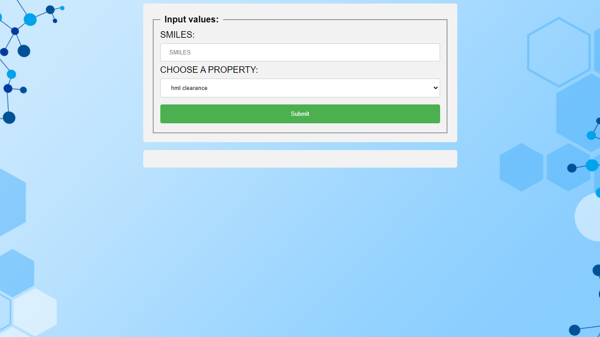

# Flask App for Molecule Property prediction


Dependencies:-
* captum
* Flask
* gunicorn
* ipython
* matplotlib
* numpy
* scikit-learn
* pytorch_lightning
* torch

Model Under the hood- Edge memory network

Molecule Properties supported:-
* hml_clearance
* t_half
* logD

## Installation
clone the repo locally.
```
git clone --single-branch https://github.com/SarthakTiwari/molecule-property-predictor-webapp.git
```
Make sure you have above mentioned dependencies installed on machine.
if not then install conda and create a new conda environment using environment.yml 

```
conda env create -f environment.yml
```

Activate this new conda environment
```
conda activate webapp_env
```
set project root folder as current working directory 

To launch webapp locally run flask 
```
flask run
```

Browse to the address you see on your terminal

you should see something like this:



After submiting SMILES and property of interest
you should see:


To deploy on Heroku
(make sure you have heroku CLI installed)
```
heroku container:login
heroku container:push web --app webapp
heroku container:release web --app webapp
```
